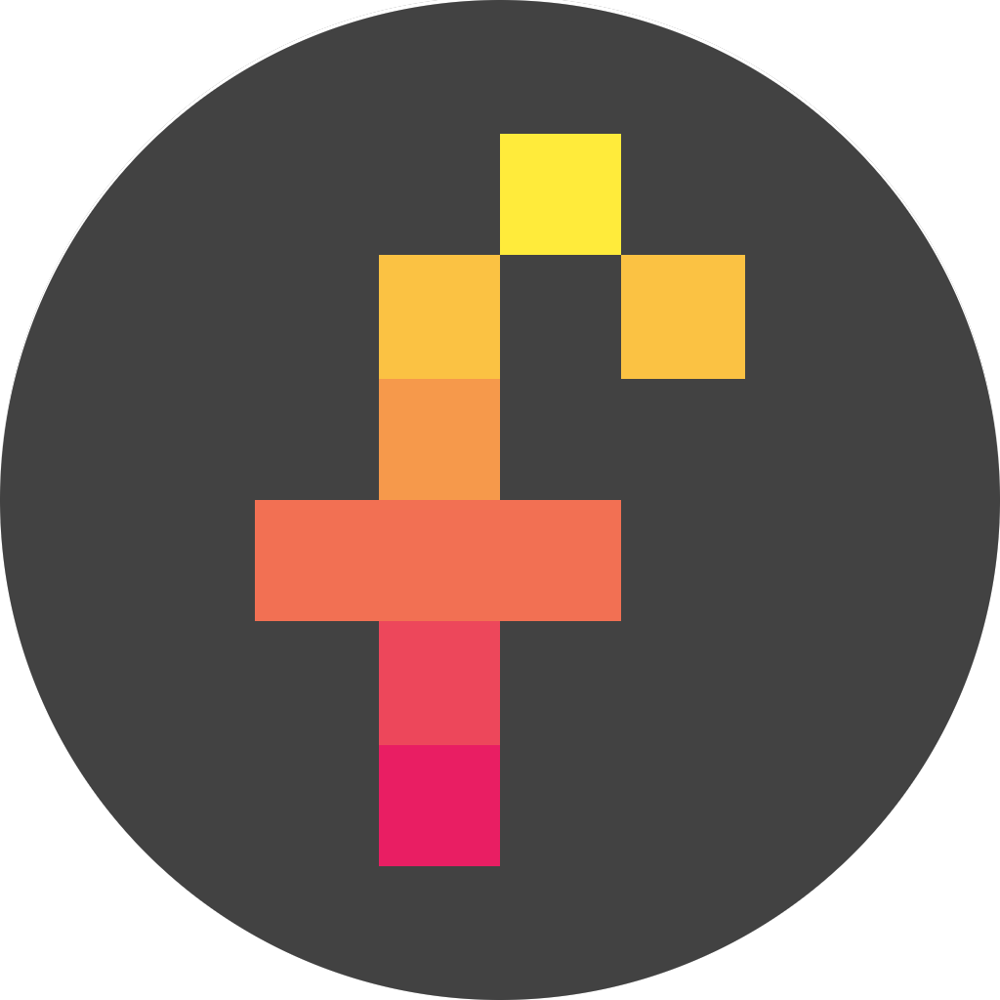
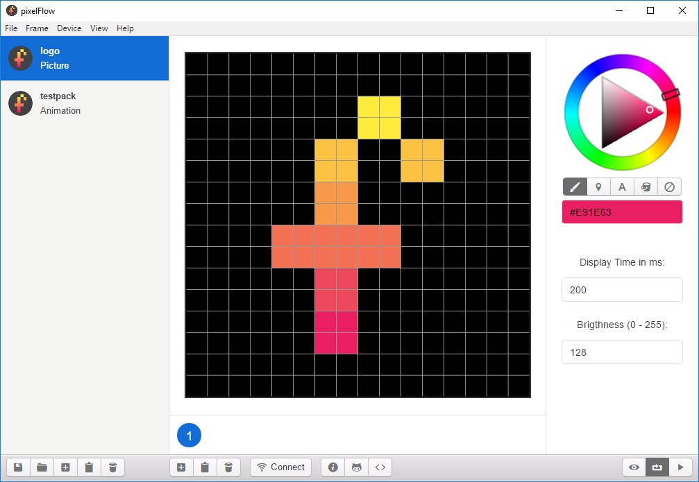

  

  <h3 align="center">pixelFlow</h3>

  

    The open source platform for 16x16 pixel displays.
     
    <a href="#status">Alpha-Stage</a>
    &middot;
    <a href="https://www.github.com/flofriday">flofriday</a>
  

## Table of contents
- [Quick start](#quick-start)
- [Status](#status)
- [Software](#software)
- [Hardware](#hardware)
- [Communication](#communication)
- [Contribute](#contribute)
- [License](#license)

## Quick Start
This platform is currently in an beta version so at the moment there
isn't anyway to start right away.

### For Developers
1. Download this repository.
2. Go into the folder "Arduino" and upload the Code on an Arduino Mega.
3. Go into the folder "App" and run `npm install`.
4. Start the Software with `npm start`.

## Status
This project is still in progress, so some features are missing. However, you
can already use it.

## Communication
Documentation for the communication will come soon.

## Software

The Software is build with Electron, therefore it runs on macOS, Windows and
Linux. Currently it can only communicate with the Ardunio over USB.

## Hardware
Documentation for the hardware will come soon.

## Contribute
Feel free to write issues.

## License
The whole platform is licensed under the [MIT License](LICENSE).

This License is also used for the Firmware and Software with only one exception.
The file `App/js/html5kellycolorpicker.min.js` is licensed under GPLv3 and was
written by ["NC22"](https://github.com/NC22/HTML5-Color-Picker).
